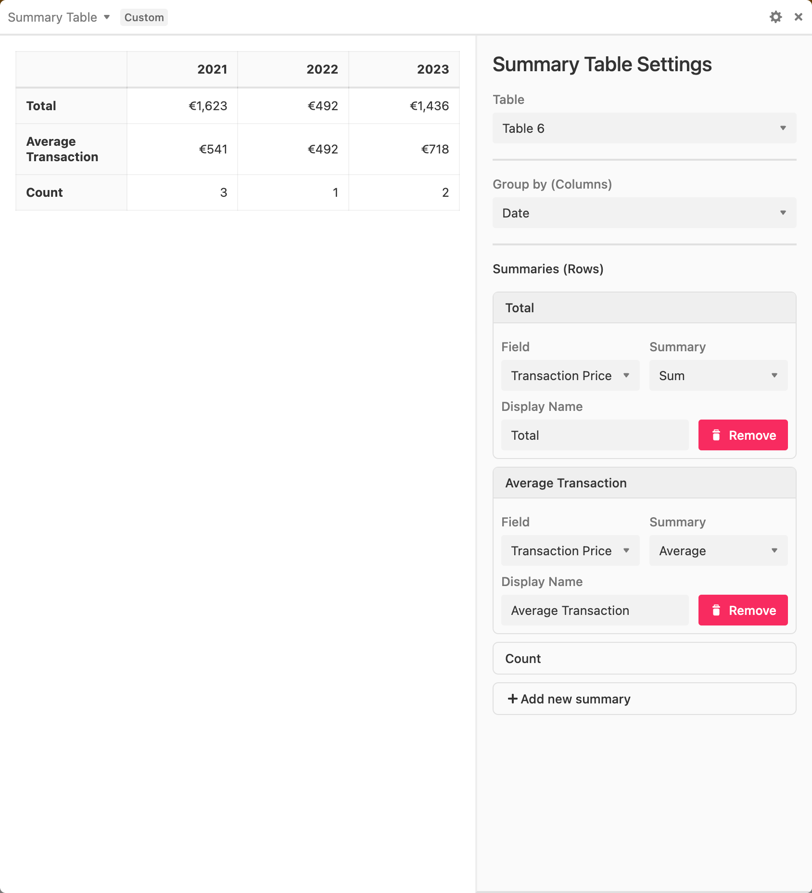

# Airtable Summary Table Block

Pivot Table in Airtable could not solve my use case, so I created this block.

## Features

For now it takes a date-like column and groups records by year.

Then you can define summaries on columns like below:

## To Do

- [ ] Improve table for responsiveness
- [ ] Allow to choose column buckets
